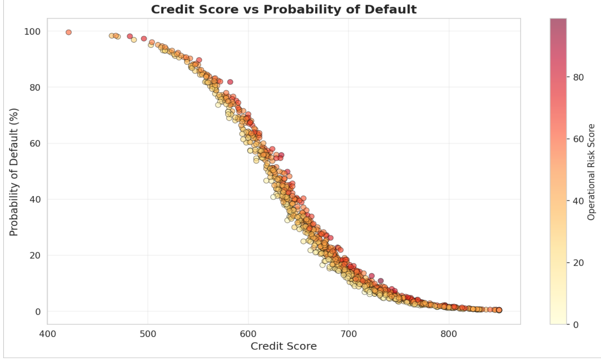

# Portfolio Risk Analysis – My Take on a Messy $68M Loan Book

Hey 👋

This is a project where I tried to figure out how risky a fake-but-realistic loan portfolio actually is.  
Think of it as: "If I were running a small lending business and had 1,000 customers borrowing money from me — how much trouble am I really in?"

I ended up building a pretty classic credit risk setup using logistic regression for probability of default (PD), some basic VaR, stress testing under ugly scenarios, and a bunch of charts that made me go "oh no" more than once.

## What actually lives here

- `portfolio_data.csv` → the main dataset (1,000 customers, credit scores, loan amounts, revenues, expenses, defaults, etc.)
- `Risk_Assessment_Report.docx` → the "serious" report I wrote pretending I was presenting to a risk committee
- (hopefully soon) `notebooks/` or `analysis.ipynb` → the actual code where the magic (and the bugs) happened

## The short version — what did I find?

- Total loans outstanding: ~$68 million
- Average predicted default probability: ~30% 😬
- Half the book (504 loans) has PD > 20% — that's not great
- If revenue drops 20% **and** expenses go up 10% at the same time → portfolio loses ~$12.6 million in a year
- Credit score is still king (correlation with PD is like -0.93 — brutal)
- Operational risk score matters way more when credit is already shaky

In plain English:  
The good borrowers are fine.  
The mediocre-and-below borrowers are carrying most of the risk — and there are a **lot** of them.

## Some visuals that tell the story better than words

Here are the main charts I created (or plan to create very soon). They show the patterns that jumped out at me while digging through the data.

### 1. Distribution of Predicted Default Probabilities


This histogram shows how the predicted probabilities of default are spread across all 1,000 customers.  
Notice the long tail on the right — that's where most of the real danger lives.

### 2. Credit Score vs Probability of Default



Super clean negative relationship.  
Once credit score drops below ~650–670, things get ugly fast. Almost no one with 800+ has any meaningful default risk.

### 3. Stress Test Results – How Bad Could It Get?


Four bars:  
- Normal (base case)  
- Revenue drops 20%  
- Expenses rise 10%  
- Both happen at once (combined nightmare)  

The last one goes negative — portfolio would lose money that year.

### 4. High-Risk Customers – Where the Concentration Is


Just showing the slice of the portfolio with PD > 20%.  
Half the loans, but way more than half the expected losses.

### 5. Screenshot from the Final Report (Executive Summary)


This is what the first page of the Word doc looks like — gives you the high-level numbers at a glance.

(If any of these images are missing or broken, it's because I'm still uploading/renaming them — ping me in issues!)

## Why I built this

Honestly? I wanted something concrete to show people who ask "so what do you actually do with risk models?"  
Also I was curious: how bad does a portfolio have to look before stress testing says "run away"?

Turns out — this one is right on the edge of "concerning but fixable" … if someone actually does something about the worst 200–300 loans.

## How to poke around

If you just want to look:

1. Open `portfolio_data.csv` in Excel / Google Sheets / whatever
2. Skim the report — the executive summary and recommendations are actually readable

If you want to rerun stuff (once I upload the notebook):

```bash

pip install pandas numpy scikit-learn matplotlib seaborn
jupyter notebook analysis.ipynb


### 1. Quick data exploration

```python
import pandas as pd

df = pd.read_csv("portfolio_data.csv")

print("Shape:", df.shape)
print("\nDefault rate: {:.1f}%".format(df["Default"].mean() * 100))
print("Average PD:    {:.1f}%".format(df["PD_Score"].mean() * 100))
print("\nHigh PD (>20%) count:", len(df[df["PD_Score"] > 0.20]))


###2. Logistic Regression – Probability of Default model
from sklearn.linear_model import LogisticRegression
from sklearn.model_selection import train_test_split
from sklearn.metrics import roc_auc_score

X = df[["Credit_Score", "Loan_Amount", "Operational_Risk_Score"]]
y = df["Default"]

X_train, X_test, y_train, y_test = train_test_split(
    X, y, test_size=0.3, random_state=42, stratify=y
)

model = LogisticRegression(class_weight="balanced", max_iter=1000)
model.fit(X_train, y_train)

proba = model.predict_proba(X_test)[:, 1]
print("Test ROC AUC: {:.4f}".format(roc_auc_score(y_test, proba)))

# Quick look at coefficients
coef = pd.DataFrame({
    "feature": X.columns,
    "coef": model.coef_[0]
}).round(4)
print(coef)


###3. Simple combined stress test
# What if revenue -20% and expenses +10% at the same time?
df_stress = df.copy()

df_stress["Net_Income_stress"] = (
    df["Revenue"] * 0.80 - df["Expenses"] * 1.10
)

base_net   = df["Net_Income"].sum()
stress_net = df_stress["Net_Income_stress"].sum()

print(f"Base case net income:     ${base_net:,.0f}")
print(f"Combined stress net:      ${stress_net:,.0f}")
print(f"Change:                   ${stress_net - base_net:,.0f}")
