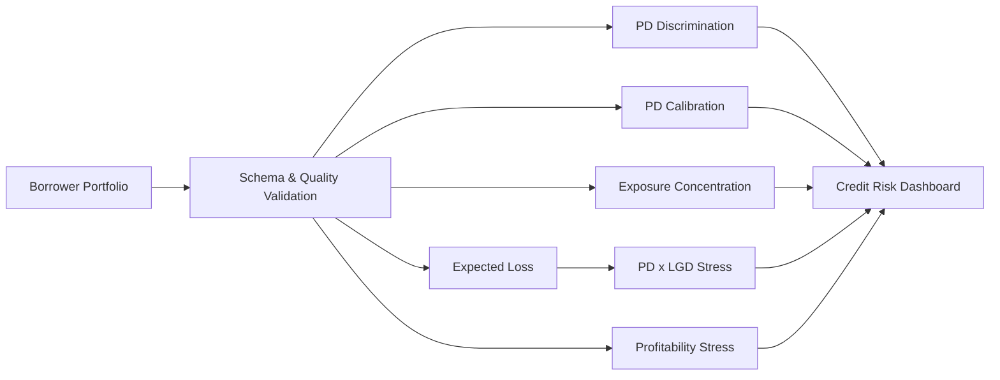

# Credit Risk Analytics & Model Monitoring Lab

[](requirements.txt)
[](src/risk_analytics.py)
[](MODEL_VALIDATION.md)
[](app.py)
[](https://github.com/ParBproject/Portfolio-Risk-Analysis-Credit-Risk-Modeling/actions/workflows/ci.yml)

A reproducible credit-risk portfolio project focused on **PD model monitoring, calibration, expected loss, exposure concentration, deterministic stress testing, profitability stress, and account prioritization**.

The bundled portfolio is **synthetic** and designed for methodology demonstration. The project does not present synthetic data as a live lending portfolio.

## Employer snapshot

| Capability | Evidence |
|---|---|
| Credit-risk analytics | PD × LGD × EAD expected loss |
| Model discrimination | ROC-AUC and KS statistic |
| Probability calibration | Brier score, log loss, calibration bands |
| Concentration risk | Largest exposure, top-10 share, HHI, effective borrower count |
| Stress testing | Independent PD and LGD multipliers with bounded probabilities |
| Business stress | Revenue/expense shocks and loss-making borrower share |
| Portfolio segmentation | Transparent PD risk bands and exposure shares |
| Review prioritization | PD/exposure-based account review queue |
| Data quality | Schema, ID, numeric, binary-label, PD-range and exposure checks |
| Reporting | Professional Streamlit model-monitoring dashboard |
| Governance | Dedicated validation note with production limitations |
| Engineering | Modular Python, tests, CI on Python 3.10/3.12 |

## Executive portfolio snapshot

The bundled illustrative portfolio contains approximately:

- **1,000 borrower records**
- **$68M of exposure**
- borrower-level observed default labels
- borrower-level probability-of-default scores
- credit score, operating-risk, revenue, expense and income fields

The original report remains available as **[Risk_Assessment_Report.docx](Risk_Assessment_Report.docx)**.

## Analytical workflow

### Credit-risk architecture


```mermaid
flowchart LR
    A[Borrower Portfolio] --> B[Schema & Quality Validation]
    B --> C[PD Discrimination]
    B --> D[PD Calibration]
    B --> E[Exposure Concentration]
    B --> F[Expected Loss]
    F --> G[PD x LGD Stress]
    B --> H[Profitability Stress]
    C --> I[Credit Risk Dashboard]
    D --> I
    E --> I
    G --> I
    H --> I
```


```text
Borrower-level portfolio data
        ↓
Schema & quality validation
        ↓
PD discrimination
(AUC / KS)
        ↓
Probability calibration
(Brier / log loss / calibration bands)
        ↓
Exposure concentration
(HHI / top shares)
        ↓
Expected loss
(EAD × PD × LGD)
        ↓
PD × LGD stress grid
        ↓
Revenue / expense operating stress
        ↓
Risk segmentation + account review queue
        ↓
Interactive monitoring dashboard
```

## Model validation

A probability model should not be evaluated with one metric alone.

The dashboard separates **discrimination** from **calibration**.

### ROC-AUC

Measures whether higher PD estimates tend to rank observed defaults above non-defaults.

A high AUC does not guarantee accurate probability levels.

### KS statistic

Measures the maximum separation between cumulative default and non-default score distributions across thresholds.

### Brier score

```text
Brier = mean((PD - Default)^2)
```

Evaluates probability accuracy.

### Log loss

Penalizes confident probability errors more heavily.

### Calibration bands

Predicted probabilities are grouped into transparent PD bands and compared with observed default rates.

The dashboard reports:

- borrower count;
- exposure;
- average predicted PD;
- observed default rate;
- calibration gap.

See **[MODEL_VALIDATION.md](MODEL_VALIDATION.md)** for model-governance context and production limitations.

## Expected loss

The portfolio expected-loss engine uses:

```text
Expected Loss = EAD × PD × LGD
```

where:

- **EAD** is represented by `Loan_Amount`;
- **PD** is represented by `PD_Score`;
- **LGD** is an explicit user assumption.

Expected loss is reported both in dollars and as a percentage of portfolio exposure.

## PD × LGD stress testing

The dashboard lets a reviewer independently shock default probability and loss severity.

```text
PD_stressed  = min(PD × PD multiplier, 100%)
LGD_stressed = min(LGD × LGD multiplier, 100%)
```

A two-dimensional stress grid makes the expected-loss sensitivity visible instead of hiding scenario assumptions in prose.

These are **deterministic sensitivity tests**, not estimates of scenario probability.

## Exposure concentration

The portfolio layer reports:

- largest-borrower exposure share;
- top-10 exposure share;
- Herfindahl-Hirschman Index;
- effective borrower count.

These metrics describe exposure concentration. They do not estimate correlated default behavior or economic capital.

## Profitability stress

Borrower operating performance can be shocked through explicit revenue and expense multipliers:

```text
Stressed Net Income
= Revenue × Revenue Multiplier
- Expenses × Expense Multiplier
```

Outputs include:

- baseline total net income;
- stressed total net income;
- income change;
- share of borrowers becoming loss-making.

## Professional dashboard

Run locally:

```bash
git clone https://github.com/ParBproject/Portfolio-Risk-Analysis-Credit-Risk-Modeling.git
cd Portfolio-Risk-Analysis-Credit-Risk-Modeling

python -m venv .venv
source .venv/bin/activate
python -m pip install -r requirements.txt

streamlit run app.py
```

The dashboard contains five workbenches:

**Model Validation**  
ROC curve, AUC, KS, Brier score, log loss, calibration chart and calibration table.

**Portfolio Risk**  
Exposure concentration, risk segments and credit-score/PD diagnostics.

**Stress Testing**  
Expected-loss sensitivity grid plus borrower profitability stress.

**Account Review**  
Transparent PD/exposure priority queue.

**Methodology**  
Metric definitions, assumptions, limitations and governance boundaries.

## Account prioritization

The review queue combines probability of default with economic materiality:

```text
Priority Score = PD × sqrt(Exposure Share)
```

This is a transparent triage mechanism.

It is **not** an underwriting rule, credit cutoff, adverse-action model, or lending decision.

## Original visual evidence

### Default-probability distribution


### Credit score vs predicted risk


### Stress-test comparison


### High-risk concentration


The current branch adds a fully interactive monitoring dashboard; screenshots should be regenerated after deployment to reflect the new interface.

## Repository structure

```text
Portfolio-Risk-Analysis-Credit-Risk-Modeling/
├── app.py
├── portfolio_data.csv
├── Risk_Assessment_Report.docx
├── src/
│   └── risk_analytics.py
├── tests/
│   └── test_risk_analytics.py
├── Screenshot/
├── .streamlit/config.toml
├── .github/workflows/ci.yml
├── MODEL_VALIDATION.md
├── requirements.txt
└── README.md
```

## Quality and reproducibility

The automated test suite verifies:

- portfolio schema and PD ranges;
- bounded discrimination metrics;
- calibration-band borrower reconciliation;
- exposure concentration reconciliation;
- stressed expected loss does not decrease under more severe PD/LGD assumptions;
- stress-grid construction;
- profitability stress reduces income under adverse assumptions.

GitHub Actions runs linting, source compilation, tests and import checks on Python **3.10 and 3.12**.

## Skills demonstrated

**Quantitative risk:** expected loss, PD/LGD sensitivity, calibration, ROC-AUC, KS, Brier score, concentration risk.

**Data analysis:** pandas, NumPy, segmentation, aggregation, validation, stress comparison, portfolio reporting.

**Model monitoring:** discrimination vs calibration, calibration gaps, bounded probability checks, governance limitations.

**Visualization:** Streamlit, Plotly, ROC curves, calibration plots, stress heatmaps, risk segmentation.

**Engineering:** modular Python, automated tests, CI/CD, uploadable data schema, defensive validation.

## Dataset limitation

The bundled portfolio is synthetic.

That is intentional and explicitly disclosed. This project demonstrates **credit-risk methodology and model-monitoring design**, while other repositories in the portfolio demonstrate work with real historical financial-market data.

A production credit model would require independent validation, out-of-time testing, stability monitoring, fairness/bias review where applicable, controlled data lineage, change governance, and regulatory/policy review.

## Responsible use

Educational credit-risk analytics project only. Nothing in this repository should be used to make real lending, underwriting, investment, or regulatory decisions.
