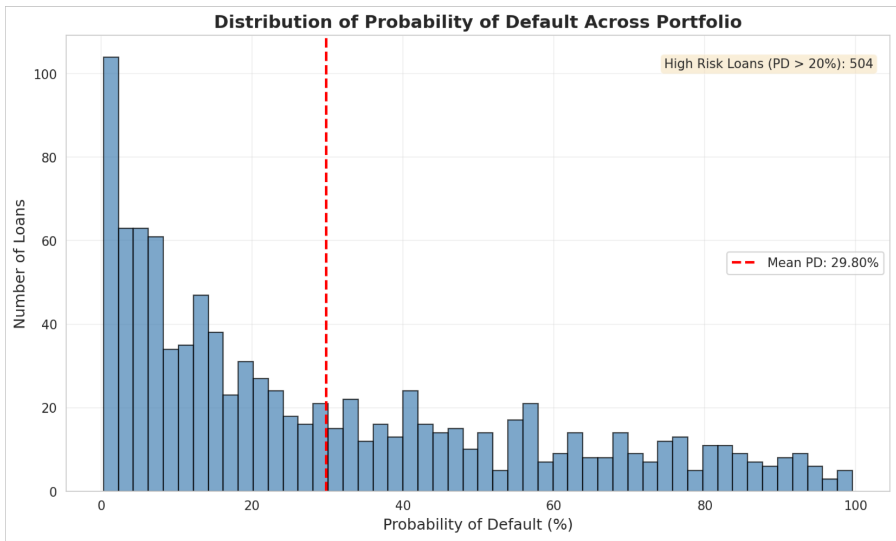
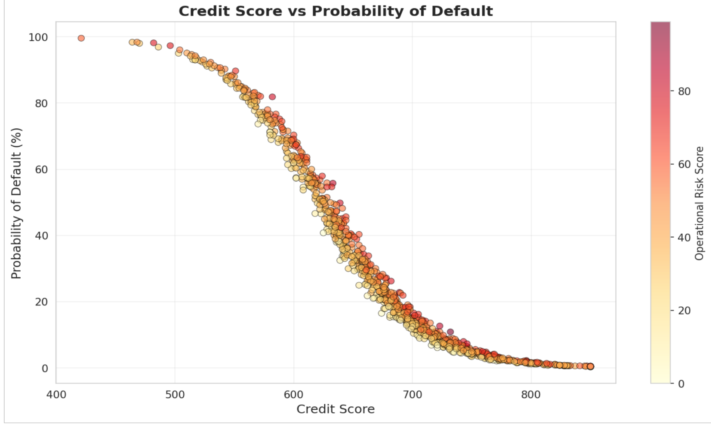
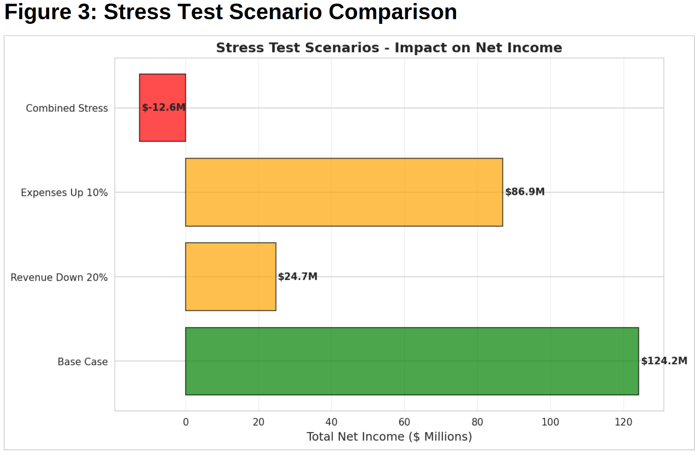
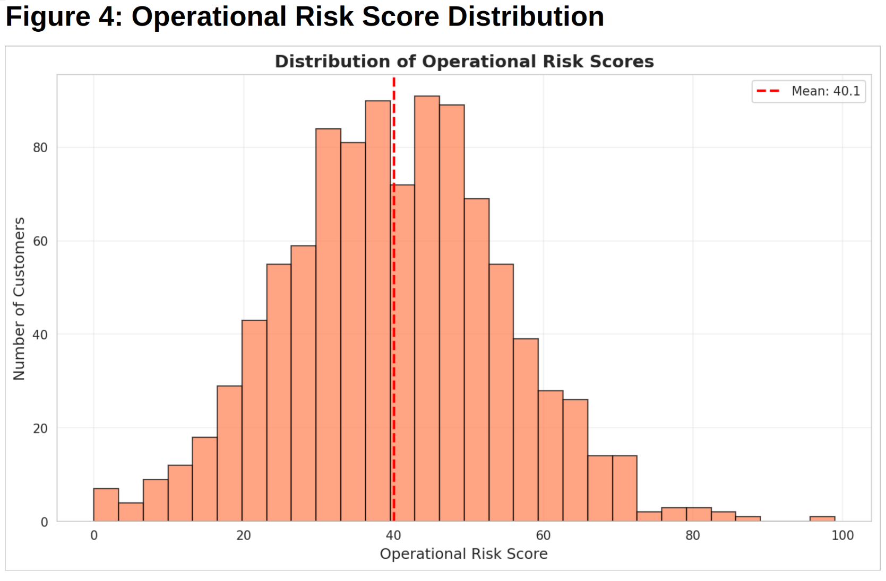

# Portfolio Risk Analysis & Credit-Risk Modeling

A credit-risk case study examining an illustrative $68M loan portfolio. The project translates borrower-level data into portfolio risk indicators, stress-test results, and management recommendations.

## Executive Snapshot

| Indicator | Result |
|---|---:|
| Portfolio size | 1,000 loans |
| Total outstanding exposure | Approximately $68M |
| Average predicted probability of default | Approximately 30% |
| Loans with predicted default probability above 20% | 504 |
| Combined stress scenario | Approximately $12.6M annual loss |

## Analytical Scope

- Borrower and portfolio-level data quality review
- Probability-of-default analysis
- Credit-score and operational-risk relationships
- High-risk concentration analysis
- Revenue and expense stress testing
- Management-focused reporting and recommendations

## Key Findings

- Risk is concentrated among borrowers with weaker credit profiles.
- Credit score has the strongest observed relationship with predicted default risk in the illustrative dataset.
- Operational risk becomes more important when borrower credit quality is already weak.
- A combined 20% revenue decline and 10% expense increase materially changes portfolio profitability.
- Prioritizing review of the highest-risk accounts offers the clearest risk-reduction opportunity.

## Visual Evidence

### Default-Probability Distribution

### Credit Score vs. Predicted Default Risk

### Stress-Test Comparison

### High-Risk Concentration

## Deliverables

| Artifact | Description |
|---|---|
| [Risk_Assessment_Report.docx](Risk_Assessment_Report.docx) | Executive risk report and recommendations |
| [portfolio_data.csv](portfolio_data.csv) | Illustrative borrower-level portfolio data |
| [Screenshot/](Screenshot/) | Supporting charts and report visuals |

## Skills Demonstrated

Credit-risk analysis, stress testing, probability of default, portfolio segmentation, data interpretation, executive reporting, and translating analytical findings into business actions.

## Data & Use Note

The portfolio is synthetic and designed for demonstration. Results are illustrative, not investment or lending advice. A production model would require independent validation, bias and stability testing, governance controls, and ongoing performance monitoring.
