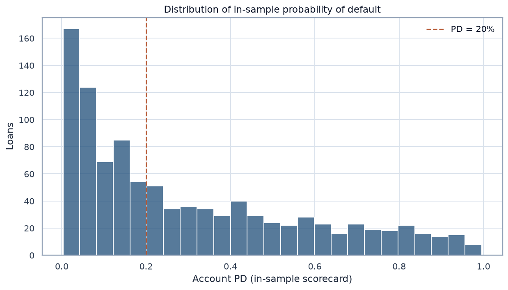
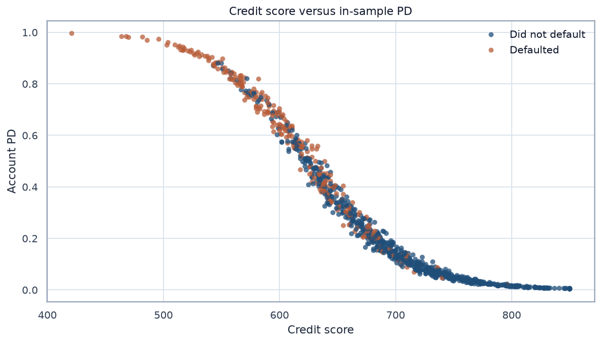
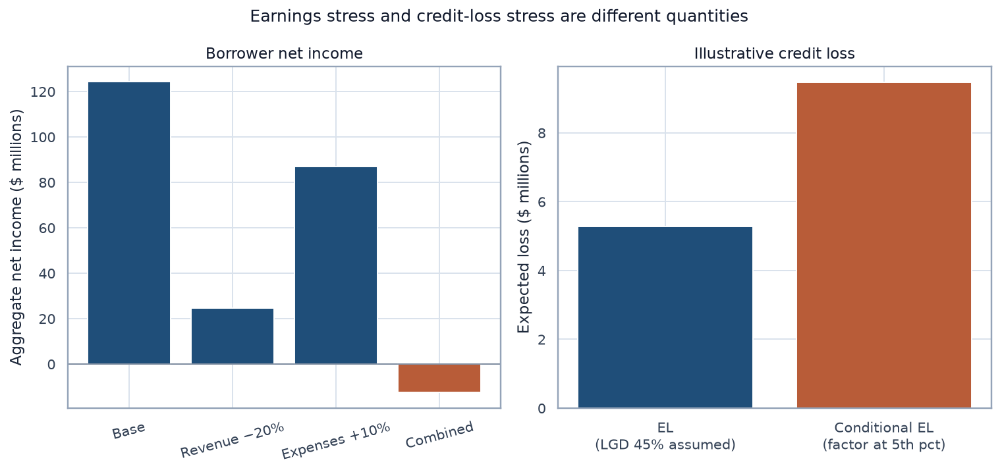
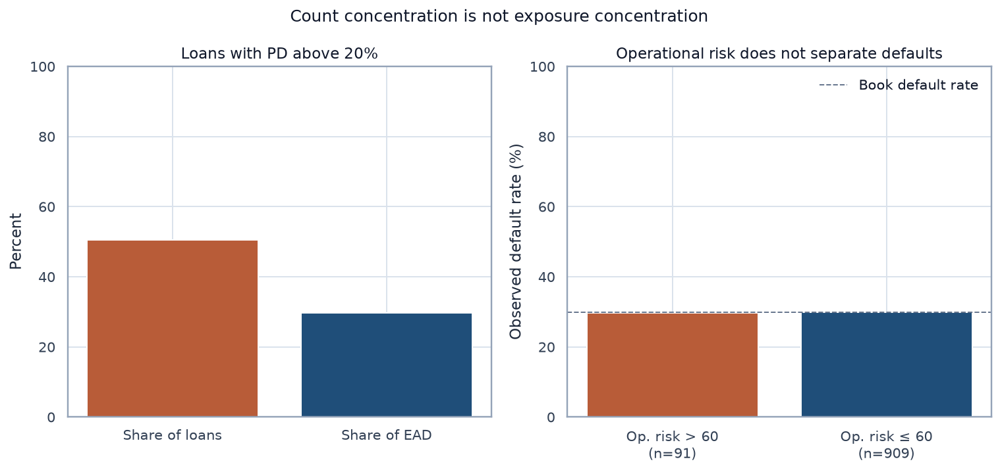

# Portfolio Risk Analysis & Credit-Risk Modeling

A credit-risk case study on an illustrative book of 1,000 loans (total EAD $68,121,079.07). The numbers below are what `python -m credit_risk` writes to [REPORT.md](REPORT.md) from [portfolio_data.csv](portfolio_data.csv).

<p align="center"></p>
<p align="center"></p>
<p align="center"></p>

[](REPORT.md)
[](portfolio_data.csv)
[](tests)

## Definitions

- **PD** is an account probability of default. On this file it is `PD_Score`: the in-sample logistic fit on credit score, loan amount, and operational risk. It is not a holdout score. Out-of-fold AUC is 0.852.
- **EAD** is outstanding loan amount, in dollars.
- **LGD** is not in the file. Illustrative dollar losses use a constant LGD of 45%. That is an assumption, not an estimate.
- **Expected loss** is PD × LGD × EAD, summed in dollars.
- **Credit-loss VaR** is a quantile of simulated portfolio loss (one-factor Gaussian copula, asset correlation 0.15, 20,000 draws, seed 42). The 99% loss quantile is larger than the 95% quantile. Correlation is an assumption, not a Basel weight.

## Executive snapshot

| Indicator | Result |
|---|---:|
| Loans | 1,000 |
| Total EAD | $68,121,079.07 |
| Unweighted mean PD | 29.80% |
| EAD-weighted mean PD | 17.23% |
| PD above 20% | 504 loans: 50.4% of count, 29.72% of EAD |
| Sum of PD × EAD (before LGD) | $11,734,442.82 |
| Illustrative expected loss (LGD 45%) | $5,280,499.32 |
| Illustrative 95% / 99% credit-loss VaR | $9,526,628.91 / $11,936,201.30 |
| Combined borrower-earnings stress | -$12,559,240.00 of aggregate borrower net income |

The earnings figure is revenue down 20% and expenses up 10%. It does not change PD or expected loss. It is not an annual loss on the loan book.

The draft memo called $43,146.55 and $25,890.70 a 95% and 99% VaR. Those are the 5th and 1st percentiles of per-account borrower net income. They are not a portfolio loss VaR.

## What the book actually shows

- Higher-PD loans are smaller, so the 29.80% unweighted PD overstates exposure-weighted default risk (17.23%).
- Credit score is the variable associated with PD (correlation -0.94). Loan amount moves with credit score (correlation 0.92); the positive loan-amount coefficient in the three-feature logit is a partial effect, and the specification is unchanged.
- Operational risk above 60 does not mark higher default rates: 27 of 91 loans (29.67%) versus 271 of 909 (29.81%).
- A 20% revenue decline cuts aggregate borrower net income by 80.07%. A 10% expense increase cuts it by 30.04%. The file has no product-segment column.

## Charts

### Default-probability distribution


### Credit score versus PD


### Earnings stress and credit-loss stress


### Concentration



## Reproduce

Pinned dependencies are in [requirements.txt](requirements.txt). Tests run in GitHub Actions.

```bash
python -m venv .venv
source .venv/bin/activate
python -m pip install -r requirements.txt
python -m pytest -q
python -m credit_risk
```

`python -m credit_risk` rewrites `REPORT.md` and `Screenshot/1.png` through `Screenshot/4.png`.

The checked-in CSV has no recoverable seed. `PD_Score` there is the full-sample fit. A separate generator draws a new book from a fixed scorecard and does not refit PD on the simulated default:

```bash
python -m credit_risk.generate --seed 42 --output synthetic_portfolio.csv
```

That file is not the case-study book, and it is gitignored.

## Deliverables

| Artifact | Description |
|---|---|
| [REPORT.md](REPORT.md) | Numerical note produced by the code |
| [Risk_Assessment_Report.docx](Risk_Assessment_Report.docx) | Narrative memo, corrected to the same definitions |
| [portfolio_data.csv](portfolio_data.csv) | Illustrative 1,000-loan book |
| [Screenshot/](Screenshot/) | Charts from `python -m credit_risk` |

## Data note

The portfolio is synthetic and for demonstration. Results are not lending or investment advice. LGD and asset correlation are assumptions. A production PD would need a real holdout, stability checks, and governance. The recommendations in the memo are judgment; this file does not measure their effect.
